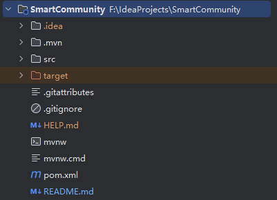
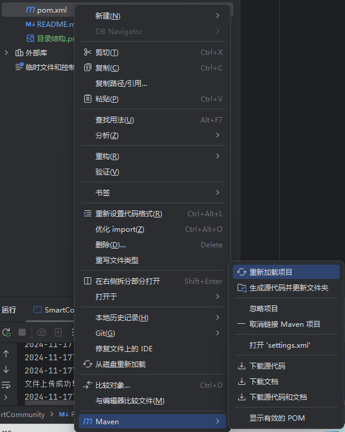

# 项目运行指南
## 环境准备
在开始之前，请确保您的开发环境中已安装以下工具：
- IntelliJ IDEA
- Maven
- JDK 1.8 或以上版本
## 克隆项目
首先，将项目代码克隆到本地。打开命令行工具，执行以下命令：
```bash
git clone https://gitee.com/TJ_Smart_Community/SmartCommunity-Back.git
```
## 打开项目
1. 打开 IntelliJ IDEA。
2. 选择 "Open" 或 "Import Project"。
3. 导航至项目所在的目录，并选择 `pom.xml` 文件。
   您将看到如下所示的目录结构：
   
## 依赖管理
1. 在 IntelliJ IDEA 中，找到 `pom.xml` 文件。
2. 右键单击 `pom.xml` 文件，选择 **Maven** > **Reload Project**。
     
   等待 Maven 完成项目依赖的下载和构建。
## 运行项目
启动项目，您可以使用 IntelliJ IDEA 内置的服务器，或者配置其他服务器。
1. 在 IntelliJ IDEA 中，找到并运行主应用程序类  
（`src/main/java/com/example/SmartCommunity/SmartCommunityApplication.java`）。
2. 等待服务器启动。
## 访问 API 文档
项目启动后，打开浏览器，访问以下链接以查看和测试 API：
[http://localhost/swagger-ui.html](http://localhost/swagger-ui.html)  
在这里，您可以浏览和调用项目中定义的所有 API。
## 项目部署
1.首先利用maven进行install生成jar包
2.利用ssh将jar包上传到/website目录,找到原jar进程kill掉再启动新jar包即可,注意旧jar包不要删掉,重命名为{origin_name}_old,防止
新包有问题可以回退
```bash
scp -r .\SmartCommunity-0.0.1-SNAPSHOT.jar ubuntu@121.5.16.33:/website
kill -9 原先jar包进程号
screen -r 1788074
java -jar SmartCommunity-0.0.1-SNAPSHOT.jar
ctrl A+D 退出 screen
```